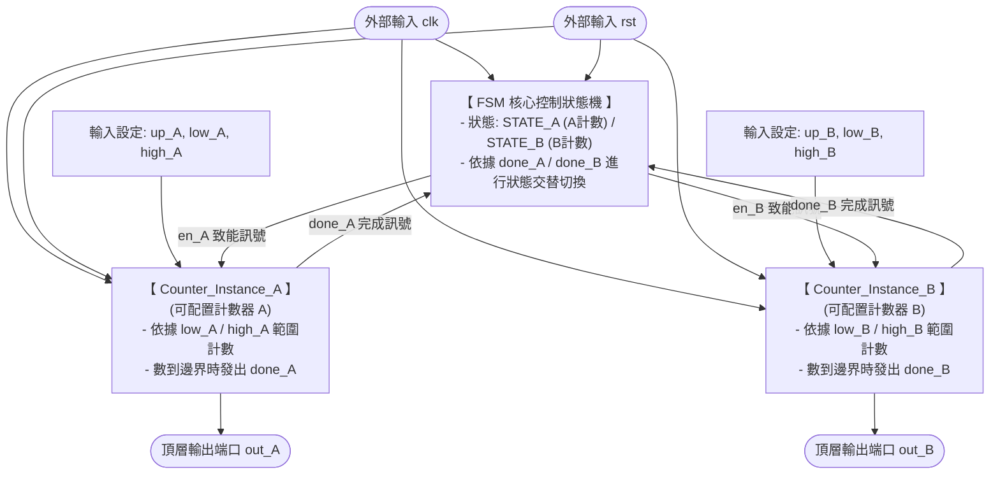

# Project 3: Dual Counter with FSM Control (雙計數器輪流計數控制系統)

## 項目簡介 (Project Description)
本項目為 FPGA 數位電路設計之 **Project 3：設計一個有限狀態機 (FSM) 控制兩個獨立計數器進行輪流計數**。

系統內部包含兩個可動態配置上下限與計數方向的通用計數器（Counter A & B）。透過頂層的 2-State FSM 進行硬體排程管理：當 Counter A 被致能並完成指定範圍的計數後，會發出完成訊號通知 FSM 切換至 Counter B；此時 Counter A 暫停，換 Counter B 開始計數，直到 Counter B 也完成計數後再切換回 Counter A。系統以此邏輯不斷循環，實現完美的硬體輪流調度。

---

## 硬體架構圖 (Block Diagram)



---

## 模組設計說明 (Module Specifications)

### 1. 可配置計數器模組 (`configurable_counter.vhd`)

* **動態邊界**：支援透過外部輸入即時變更計數下限（`lower_bound`）與上限（`upper_bound`）。
* **方向控制**：藉由 `up_down` 訊號控制計數器為正向上數（`1`）或反向下數（`0`）。
* **自動邊界判定**：當計數值抵達設定的極限時，內部組合邏輯會立刻拉高 `done` 訊號，並在下一個時脈正緣自動執行 Wrap-around（歸繞）回到起始點。

### 2. 頂層控制模組 (`dual_counter_fsm_top.vhd`)

* **FSM 狀態機核心**：內建 `STATE_A` 與 `STATE_B` 兩個狀態，專職負責雙計數器的排程控制。
* **狀態轉移邏輯**：
* 處於 `STATE_A` 時：僅拉高 `en_A` 啟用 Counter A。當接收到 `done_A = '1'` 時，下一狀態轉移至 `STATE_B`。
* 處於 `STATE_B` 時：僅拉高 `en_B` 啟用 Counter B。當接收到 `done_B = '1'` 時，下一狀態跳回 `STATE_A`。


### 3. 測試平台 (`tb_dual_counter_fsm.vhd`)

* **時脈模擬**：產生週期為 10ns（頻率 100MHz）的系統時脈。
* **硬體測試配置**：
* **Counter A**：配置為 `up_A = '1'`（上數），範圍 `0000` 到 `0111`（0 至 7）。
* **Counter B**：配置為 `up_B = '0'`（下數），範圍 `1111` 到 `1000`（15 至 8）。


---

## 實體佈線後時序延遲分析 (Post-Implementation Timing Analysis)

為了驗證本控制系統在真實 FPGA 晶片硬體上的可靠度，專案進行了 **Behavioral Simulation（功能模擬）** 與 **Post-Implementation Timing Simulation（實體佈線後時序模擬）** 的進階對比分析。

### 理想邏輯與真實物理波形比對

根據 Vivado 實際模擬結果，功能與時序表現存在關鍵性的物理走線差異：

| 評比指標 | Behavioral Simulation (功能模擬) `[理想狀態波形]` | Post-Implementation Simulation (佈線後時序) `[真實物理波形]` |
| --- | --- | --- |
| **延遲模型限制** | **零物理延遲 (Zero Delay)**訊號跳變與 `clk` 沿百分之百同步。 | **走線與邏輯閘傳播延遲**包含 $T_{co}$（內部暫存器延遲）與 $T_{routing}$（線路延遲）。 |
| **交棒過渡期** | 當 `out_A` 數到 `7` 結束時，在同一個時脈時間點 `out_B` **無縫接軌**從 `15` 開始倒數。 | 在交棒邊界時，訊號會因為狀態機解碼和硬體走線產生些微的**時間不對稱與延遲偏斜**。 |
| **開機不確定態** | 模擬剛啟動（0~20ns 重置期）時，系統直接完美呈現乾淨的電位值。 | 在模擬最前端，重置訊號尚未傳播完成前，波形圖會顯現出**紅色不可知狀態（X 態）**。 |

### 時序物理延遲成因分析

1. **Clock-to-Output Delay ($T_{co}$)**：在時序模擬波形中，放大的時脈上升沿處可以清楚觀察到，`out_A` 與 `out_B` 的匯流排數值變化均落後於系統 `clk` 沿。這是暫存器實體電路內部正反器切換所需的固有物理時間。
2. **組合邏輯排程延遲**：本系統的交棒依賴 `done_A/B` 傳回頂層 FSM，再經由狀態解碼產生 `en_A/B` 送回計數器。這條「跨模組閉迴路」在實體繞線後會累積一定的組合邏輯延遲，但由於時脈週期設定在寬裕的 10ns (100MHz)，這些延遲完美限縮在安全餘裕（Timing Slack）內，波形穩定且無任何不合法毛邊（Glitch）。

---

## 模擬環境與運行指引 (How to Run)

1. 將 `configurable_counter.vhd` 與 `dual_counter_fsm_top.vhd` 檔案加入至 **Xilinx Vivado** 專案的 `Design Sources` 中。
2. 將 `tb_dual_counter_fsm.vhd` 加入至 `Simulation Sources` 中。
3. 在 Vivado 左側選單點擊 **Run Simulation -> Run Behavioral Simulation** 觀測理想功能接力波形。
4. 點擊 **Run Simulation -> Run Post-Implementation Timing Simulation** 驗證佈線後的硬體真實延遲與穩定度。
5. **波形觀察重點**：驗證 `out_A` 從 0 數到 7 結束後是否自動暫停，並在經過微小的實體走線延遲後，立刻由 `out_B` 接手從 15 倒數到 8，以此不斷接力循環。

```
